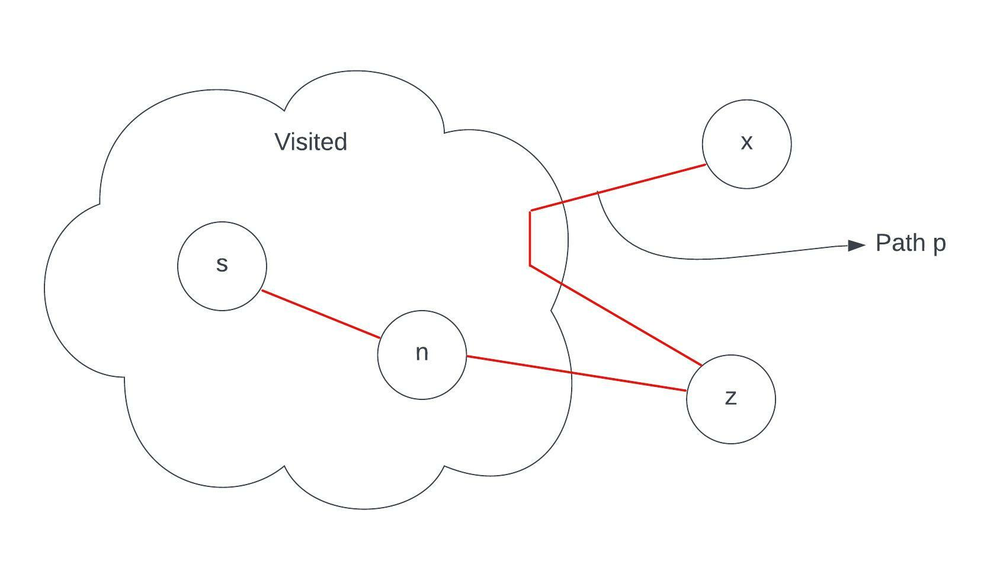

# Single Source Shortest Path Algorithms

## Relaxation

For each vertex v ∈ V, we maintain an attribute `v.d` which is **an upper bound on the weight of a shortest path from source s to v**. `v.d` is called the _shortest path estimate_.

```text
Time Complexity: O(V)

INITIALIZE-SINGLE-SOURCE(G, s):
    for each vertex v ∈ (G.V):
        v.d = inf
        v.parent = NULL
    s.d = 0
```

The process of **relaxing** an edge (u, v) consisting of testing whether there is any scope of improvement of the _shortest path estimate_ to v by going through u, and if so, update `v.d` and `v.parent`.

```text
Time Complexity: O(1)

RELAX(u, v, wt):
    if v.d > u.d + wt(u, v):
        v.d = u.d + wt(u, v)
        v.parent = u
```

---

## Bellman Ford Algorithm

- Dynamic Programming Algorithm
- Supports -ve edges.
- _Jist of the algorithm_:
  - Given a weighted directed graph G = (v, E) with negative weight edges wt : E -> R and a source s. The algorithm returns a boolean value which indicates whether or not there is a negative edge cycle present in the graph; if present it returns `false` otherwise returns `true` and produces the **shortest paths and their path-weights**.

- **Algorithm**

```text
INITIALIZE-SINGLE-SOURCE(G, s);
for i = 1 to (|G.V| - 1):
    for each edge ∈ G.E:
        RELAX(u, v, wt);
for each edge ∈ G.E:
    if (v.d > w.d + wt(u, v)):
        return FALSE
return TRUE

Net time complexity: O(VE + E) = O(VE)
```

- **Implementation**

```cpp
std::vector<std::list<std::pair<int, int>>> g;

class Edge {
public:
    int u, v;
    int wt;
    Edge(int u, int v, int wt) {
        this->u = u;
        this->v = v;
        this->wt = wt;
    }
};

class triplet {
public:
    std::vector<int> v1;
    std::vector<int> v2;
    bool b;
    triplet(std::vector<int> v1, std::vector<int> v2, bool b) {
        this->v1 = v1;
        this->v2 = v2;
        this->b = b;
    }
};

triplet bellmanford(int src, int vertices) {
    std::vector<int> sd(vertices, INT_MAX);
    std::vector<int> parent(vertices, -1);

    sd[src] = 0;

    std::vector<Edge> edges;

    for(auto &ne:g[src]){
        Edge e = Edge(src, ne.first, ne.second);
        edges.emplace_back(e);
    }

    for(int i=0;i<vertices;i++){
        if(i == src) continue;
        for(auto &ne:g[i]){
            Edge e = Edge(i, ne.first, ne.second);
            edges.emplace_back(e);
        }
    }

    for (int i = 1;i <= vertices - 1;i++) {
        for(auto &edge:edges){
            if(sd[edge.v] > sd[edge.u] + edge.wt){
                sd[edge.v] = sd[edge.u] + edge.wt;
                parent[edge.v] = edge.u;
            }
        }
    }

    for(int i=0;i<edges.size();i++){
        if(sd[edges[i].v] > sd[edges[i].u] + edges[i].wt){
            return triplet({}, {}, false);
        }
    }

    return triplet(sd, parent, true);
}

int main(int argc, char const* argv[]) {
    clock_t begin = clock();
    file_i_o();
    // Write your code here....

    int vertices, edges;
    std::cin >> vertices >> edges;

    g.resize(vertices, std::list<std::pair<int, int>>());

    while (edges--) {
        int u, v;
        int wt;
        std::cin >> u >> v >> wt;
        g[u].push_back({ v, wt });
        // g[v].push_back({ u, wt });
    }

    triplet temp = bellmanford(0, vertices);
    if(temp.b){
        std::cout<<"shortest Distance Array:\n";
        logarr(temp.v1, 0, temp.v1.size()-1);

        std::cout<<"\nParent array:\n";
        for(int i=0;i<temp.v2.size();i++){
            if(temp.v2[i] == -1) continue;
            std::cout<<temp.v2[i]<<" -> "<<i<<"\n";
        }
    } else {
        std::cout<<"Cycle Detected";
    }

    return 0;
}
```

_Why V-1 times???_

- In worst case, appears for a complete (connected) graph, each node can be connected directly by _V-1_ other nodes. So, on one node, _V-1_ nodes can effect that one particular node.

---

## Directed Acyclic Graph (DAG)

- Shortest paths are always wel defined in a DAG, since even if there are negative-weight edges, no negative-weight cycles can exist.
- By relaxing the edges of a weighted DAG G = (V, E) according to the topological sort of the vertices, we can compute shortest paths from a single source in O(V+E) time.
- _Jist of Algorithm_:
  - Topological Sort of the vertices results in linear ordering of the verices. If the DAG contains a path from `u` to `v` then `u` precedes `v` in the topological sorting order. Just make one pass over the topological sorted order and **relax** each outgoing edge from the vertex.
- **Algorithm**

```text
DAG-SHORTEST-PATH(G, s, wt):
    A = TOPOLOGICAL-SORT(G); 
    INITIALIZE-SINGLE-SOURCE(G, s);
    for each vertex u ∈ A:
        for each vertex v ∈ G.neighbours[u]:
            RELAX(u, v, wt);

Time Complexity: O((V+E) + V + (V+E)) = O(V+E)
```

---

## Dijkstra's Algorithm

- Solves the single-source shortest-paths problem for a graph G = (V, E) having non-negative edge-weights. Hence,

```text
w(u, v) >= 0 for each edge (u, v) ∈ E.
```

- Dijkstra's running time is lower than that of Belman Ford's algo.
- Greedy + BFS = Dijkstra algorithm
- _Jist of Algorithm_:
  - A set S of vertices, whose shortest-path weights are already determined, are maintained. The algorithm repeatedly selects the vertex u ∈ V-S with **minimum shortest path estimate** and adds it to set S, and **relaxes** all the outgoing edges from u. Use of a _min-priority queue_, keyed by their _d_ values (minimum shortest path estimate).
- **Algorithm**

```text
DIJKSTRA(G, s, wt):
    S = []
    Q = G.V
    while Q != []:
        u = EXTRACT-MIN(Q);
        S = S U {u}
        for each vertex ∈ G.neighbours[u]:
            RELAX(u, v, wt)
```

- **Implementation**

```cpp
std::vector<std::list<pii>> graph;

std::vector<int> bfs(int src){
    std::vector<int> sd(graph.size(), INT_MAX);
    std::priority_queue<pii, std::vector<pii>, std::greater<pii>> q;

    sd[src] = 0;

    for(int i = 0;i < sd.size(); i++){
        q.push({sd[i], i});
    }

    std::vector<bool> vis(graph.size(), false);

    while(not q.empty()){
        pii curr = q.top();
        q.pop();
        if(vis[curr.second])
            continue;
        vis[curr.second] = true;
        for(auto &ne:graph[curr.second]){
            int ne_node = ne.first;
            int wt = ne.second;
            if(sd[ne_node] > sd[curr.second] + wt){
                sd[ne_node] = sd[curr.second] + wt;
                q.push({sd[ne_node], ne_node});
            }
        }
    }

    return sd;
}
```

- **Proof of Correctness**

```text
# D(s, u) => min distance computed by Dijkstra Algo from source s to a vertex u
# y(s, u) => actual min distance between source s and vertex u.
```

_To Proof_: ==D(s, u) = y(s, u)== where, `u` is marked `visited` or `u` is in `reached set`.

_Proof_:  
(Proof by Contradiction)

```text
Suppose the statement D(s, u) != y(s, u).

Then there are some vertices such that when u is included in the reached set: D(s, u) > y(s, u)

Let x is the first vertex included in the visted/reached set.

If x is the first vertex:
        D(s, x) > y(s, x)
    => all the vertices m, that were included in visited/reached set folows: D(s, m) = y(s, m)

By analyzing the moment when x is going to be included:
        >Let p be the real shortest path from S to x.
        >Let z is the first vertex not in the visited set and is on the shortest path.
        >Let n is the predecessor of z included in the path p and in visited.
```

Diagram: 


```text
Hence, we can say D(s, n) = y(s, n)

Now,
    D(s, z) = D(s, n) + wt(n, z)
            = y(s, n) + wt(n, z)

Since, we have assumed that x is the first node that violates the condition of D(s, u) = y(s, u) where u ∈ V, and z is to be visited after x, hence, 
        D(s, x) <= D(s, z)
and, y(s, x) = y(s, z) + y(z, x)

Now, D(s, x) <= D(s, z)
=> D(s, x) <= y(s, n) + wt(n, z) + y(z, x)
=> D(s, x) <= y(s, x)

Therefore, the contradiction is false.

Now, y(s, x) is the actual shortest path, so < is not valid.

Hence, D(s, x) = y(s, x)
```
